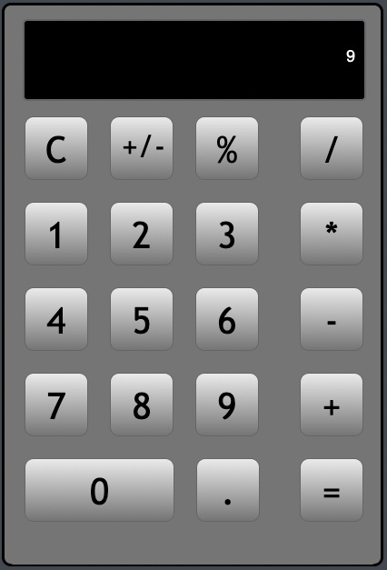

# #Calc, (HashtagCalc)  


## a Calculator app   



## version 2.0a

  - Goal : get the app working, to a reasonable degree

  - (currently has bugs)

  -  Basic mode

    - will be Default Mode *(only mode for now =)*
    - 1 line display, to show input of numbers
    - buttons and operation
      - AC/AC      : all clear or clear
      - *, /, + - : basic math: multiply, divide, add, subtract
      - %         : convert or work with percentages
      - -/+       : converting to a negative or positive number
      - .         : decimal, for entering a number with a decimal
      - =         : equals, or sum, of current math operations

## version 2.1a

  - Goal :

    - implement new app data model

    - simplify and create better app logic

    - finish all-clear/clear functionality

    - setup basis for additional features

    - [see devNotes](/Users/danielperez/SoftwareDevelopment/Github/A-Calculator/devNotes/MajorCodeChange-InputObjectArray.txt)

## version 3.0a

  - Goal : implement at least 2 "coming features"

## Coming Features

  - complete All Clear and Clear (currently has bugs)

    - AC and C functions, to work as standard calculator    

    - a "novel" backspace key
      - when entering numbers, AC becomes backspace key
      - as all of current entry backspaced
      - then backspace turns into C,
      - becomes into AC when no current values to clear,

  - logging feature
    - internal storage of app status and values
    - error codes generated by browser, stored also
    - "send to support" feature

  - Memory functions

  - show math feature
    - when enabled, if entering "3" "+" "3" "="
    - middle display line to show:                3 + 3
    - when pressing =, bottom line to show :          6
      - on 2nd calc, another number with 3rd operator
        - top display line to show                   3 + 3
        - middle display line to show:               6 * 3
        - when pressing =, bottom line to show :        18

  - a show tape feature, a history of math operations
    - a complete separate window,
    - history of math and results
    - uses available browser functionality
      - like "send to" or "share", to print, msg or email

  - more modes with advanced calculator layout

  - MIT License

## Current Version 2.0a

### Milestone

  - all basic mode features, unit tested successfully
  - basic math operations give correct answers

  - javascript custom debug feature
    - manually enable in browser javascript console
    - wrapped console.log, but preserving line number
    ```
    console.log.bind(window.console)  
    ```
    - [click here for notes from stackoverflow.com](https://stackoverflow.com/questions/13815640/a-proper-wrapper-for-console-log-with-correct-line-number)

### TODO

  - current bug
    - multiple math ops
      - when to use opValue2
    - posNeg math ops
      - when to use opValue
      - apply mathOp to correct numbers entered

  - debugger
    - error logging and error handling
  - tape
    - history of input and math results

  - for release
    - improve logic for tracking input, calculations
    - port to react or bootstrap

  - UI features
    - a menu
      - a "show tape" button in the menu
      - actually displaying the tape
    - a backspace key,
      - preferably within current UI

  - backend ops
    - new build environment
    - considering a CMS
